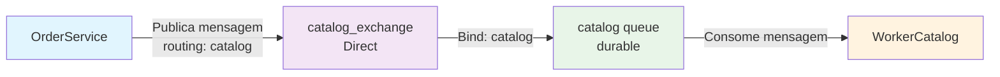

# 📋 **Documentação: Correção do RabbitMQ - OrderService e WorkerCatalog**

## 🎯 **Objetivo**
Corrigir o problema onde o WorkerCatalog não estava consumindo mensagens da fila RabbitMQ publicadas pelo OrderService.

## ❌ **Problema Identificado**

### **Sintomas:**
- OrderService publicava mensagens na fila `catalog` ✅
- WorkerCatalog não consumia as mensagens ❌
- Mensagens ficavam acumuladas na fila sem processamento

### **Causa Raiz:**
- **Falta de Bind:** A fila `catalog` não estava vinculada ao exchange
- **Exchange Padrão:** Tentativa de usar exchange padrão (vazio) que não permite bind
- **Roteamento:** Mensagens não chegavam na fila devido à falta de roteamento

## 🔧 **Solução Implementada**

### **1. Criação de Exchange Nomeado**
- **Exchange:** `catalog_exchange`
- **Tipo:** `Direct`
- **Durabilidade:** `true`
- **Auto-delete:** `false`

### **2. Bind da Fila ao Exchange**
- **Fila:** `catalog`
- **Exchange:** `catalog_exchange`
- **Routing Key:** `catalog`

## 📝 **Modificações Realizadas**

### **OrderService/Services/RabbitMqClient.cs**

```csharp
// ANTES (❌ Não funcionava)
await channel.QueueDeclareAsync(
    queue: "catalog",
    durable: true,
    exclusive: false,
    autoDelete: false,
    arguments: arguments!);

await channel.BasicPublishAsync(
    exchange: string.Empty, // Exchange padrão
    routingKey: "catalog",
    body: body);

// DEPOIS (✅ Funcionando)
// Declarar exchange nomeado primeiro
await channel.ExchangeDeclareAsync(
    exchange: "catalog_exchange",
    type: ExchangeType.Direct,
    durable: true,
    autoDelete: false);

await channel.QueueDeclareAsync(
    queue: "catalog",
    durable: true,
    exclusive: false,
    autoDelete: false,
    arguments: arguments!);

// Fazer bind da queue ao exchange nomeado
await channel.QueueBindAsync(
    queue: "catalog",
    exchange: "catalog_exchange",
    routingKey: "catalog");

await channel.BasicPublishAsync(
    exchange: "catalog_exchange", // Exchange nomeado
    routingKey: "catalog",
    body: body);
```

### **WorkerCatalog/Services/RabbitMqClient.cs**

```csharp
// ANTES (❌ Não funcionava)
await _channel.QueueDeclareAsync(
    queue: "catalog",
    durable: true,
    exclusive: false,
    autoDelete: false,
    arguments: arguments!);

await _channel.BasicConsumeAsync("catalog", autoAck: false, consumer: consumer);

// DEPOIS (✅ Funcionando)
// Declarar exchange nomeado primeiro
await _channel.ExchangeDeclareAsync(
    exchange: "catalog_exchange",
    type: ExchangeType.Direct,
    durable: true,
    autoDelete: false);

await _channel.QueueDeclareAsync(
    queue: "catalog",
    durable: true,
    exclusive: false,
    autoDelete: false,
    arguments: arguments!);

// Fazer bind da queue ao exchange nomeado
await _channel.QueueBindAsync(
    queue: "catalog",
    exchange: "catalog_exchange",
    routingKey: "catalog");

await _channel.BasicConsumeAsync("catalog", autoAck: false, consumer: consumer);
```

## 🏗️ **Arquitetura Final**



### **Fluxo de Dados:**
1. **OrderService** publica mensagem no `catalog_exchange` com routing key `catalog`
2. **Exchange** roteia a mensagem para a fila `catalog` baseado no routing key
3. **WorkerCatalog** consome a mensagem da fila `catalog`
4. **Processamento** da atualização de estoque é executado

## ✅ **Resultado**

### **Antes:**
- ❌ Mensagens não chegavam na fila
- ❌ WorkerCatalog não processava eventos
- ❌ Atualizações de estoque não funcionavam

### **Depois:**
- ✅ Mensagens roteadas corretamente
- ✅ WorkerCatalog consome e processa mensagens
- ✅ Atualizações de estoque funcionando
- ✅ Fluxo completo OrderService → RabbitMQ → WorkerCatalog

## 🔍 **Comandos de Verificação**

```bash
# Verificar filas e mensagens
docker exec -it rabbitmq rabbitmqctl list_queues name messages consumers

# Verificar exchanges
docker exec -it rabbitmq rabbitmqctl list_exchanges

# Verificar bindings
docker exec -it rabbitmq rabbitmqctl list_bindings

# Verificar logs do WorkerCatalog
docker logs workercatalog -f

# Verificar logs do OrderService
docker logs orderservice -f
```

## 📊 **Configurações da Fila**

| Propriedade | Valor |
|-------------|-------|
| **Nome** | `catalog` |
| **Exchange** | `catalog_exchange` |
| **Tipo Exchange** | `Direct` |
| **Routing Key** | `catalog` |
| **Durabilidade** | `true` |
| **Dead Letter Exchange** | `dead_letters` |
| **Dead Letter Routing Key** | `catalog.dlx` |
| **Max Length** | `100` |

## 🎯 **Benefícios Alcançados**

1. **✅ Comunicação Funcional:** OrderService e WorkerCatalog comunicam via RabbitMQ
2. **✅ Processamento Assíncrono:** Atualizações de estoque processadas em background
3. **✅ Durabilidade:** Mensagens persistem mesmo com reinicialização
4. **✅ Dead Letter Queue:** Mensagens com erro vão para fila de tratamento
5. **✅ Limite de Fila:** Máximo 100 mensagens para evitar sobrecarga

## 🚀 **Como Testar**

### **1. Verificar Status dos Containers**
```bash
docker-compose ps
```

### **2. Verificar Logs**
```bash
# Logs do WorkerCatalog
docker logs workercatalog -f

# Logs do OrderService
docker logs orderservice -f
```

### **3. Testar Publicação de Mensagem**
```bash
# Via API (se disponível)
curl -X POST http://localhost:5000/orders/orderns/gerar-ordem \
  -H "Content-Type: application/json" \
  -d '[{"produtoId":"123e4567-e89b-12d3-a456-426614174000","quantidade":5}]'
```

### **4. Verificar RabbitMQ Management**
- Acesse: `http://localhost:15672`
- Login: `guest` / `guest`
- Verifique:
  - Exchange `catalog_exchange` existe
  - Queue `catalog` tem bindings ativos
  - Mensagens sendo processadas

## 📋 **Checklist de Validação**

- [ ] Exchange `catalog_exchange` criado
- [ ] Queue `catalog` vinculada ao exchange
- [ ] OrderService publica mensagens
- [ ] WorkerCatalog consome mensagens
- [ ] Logs mostram processamento
- [ ] RabbitMQ Management mostra atividade

---

**Data da Implementação:** $(date)  
**Status:** ✅ Implementado e Funcionando  
**Responsável:** Desenvolvimento

