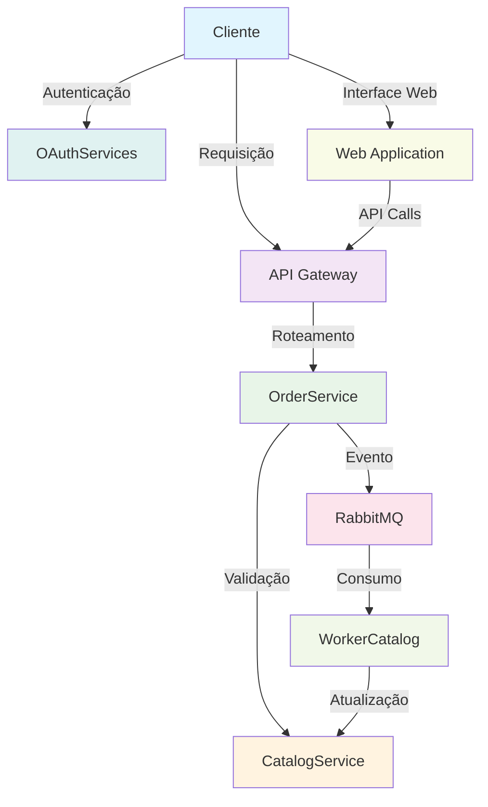
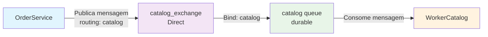

# 🏪 **Sistema de Microserviços - E-commerce**

## 📖 **Introdução**

Este projeto implementa uma arquitetura de microserviços para um sistema de e-commerce, demonstrando conceitos modernos de desenvolvimento distribuído, comunicação assíncrona e gerenciamento de dados. O sistema é composto por múltiplos serviços independentes que trabalham em conjunto para fornecer funcionalidades completas de catálogo, pedidos, autenticação e processamento de eventos.

## 🎯 **Contexto**

Em um cenário de e-commerce moderno, é essencial ter uma arquitetura escalável e resiliente que possa lidar com diferentes volumes de tráfego e permitir evolução independente de cada componente. Este projeto aborda esses desafios através de:

- **Separação de Responsabilidades**: Cada serviço tem uma responsabilidade específica e bem definida
- **Comunicação Assíncrona**: Uso de RabbitMQ para processamento de eventos em background
- **API Gateway**: Ponto único de entrada para gerenciar requisições e roteamento
- **Autenticação Centralizada**: Sistema OAuth para gerenciamento de usuários e tokens
- **Processamento de Eventos**: Worker services para operações assíncronas

## 🏗️ **Cenário de Negócio**

O sistema simula um e-commerce onde:

1. **Clientes** fazem pedidos através de uma API
2. **Sistema** valida produtos no catálogo
3. **Pedidos** são processados e estoque é atualizado
4. **Eventos** são processados de forma assíncrona
5. **Logs** são centralizados para monitoramento

## 🔧 **Arquitetura dos Microserviços**

### 🌐 **ApiGateway**
**Porta:** 5000/5001  
**Responsabilidade:** Ponto único de entrada e roteamento de requisições

- **Funcionalidades:**
  - Roteamento de requisições para serviços apropriados
  - Middleware de correlação de IDs para rastreamento
  - Logging centralizado de todas as requisições
  - Gerenciamento de CORS e políticas de segurança

- **Tecnologias:**
  - ASP.NET Core 9.0
  - Entity Framework Core
  - SQL Server (sql3)

### 📦 **CatalogService**
**Porta:** 8080/8081  
**Responsabilidade:** Gerenciamento do catálogo de produtos

- **Funcionalidades:**
  - CRUD de produtos
  - Validação de disponibilidade
  - Atualização de estoque
  - Paginação e filtros
  - Validação de lista de produtos

- **Endpoints Principais:**
  - `GET /catalog/produtos` - Listar produtos
  - `POST /catalog/produtos` - Criar produto
  - `PUT /catalog/produtos/{id}` - Atualizar produto
  - `POST /catalog/produtos/validar-lista-produtos` - Validar lista

- **Tecnologias:**
  - ASP.NET Core 9.0
  - Entity Framework Core
  - SQL Server (sql2)

### 🔐 **OAuthServices**
**Porta:** 5004/5005  
**Responsabilidade:** Autenticação e autorização

- **Funcionalidades:**
  - Geração de tokens JWT
  - Validação de credenciais
  - Gerenciamento de sessões
  - Middleware de autenticação

- **Endpoints Principais:**
  - `POST /auth/login` - Autenticação
  - `POST /auth/validate` - Validação de token
  - `POST /auth/refresh` - Renovação de token

- **Tecnologias:**
  - ASP.NET Core 9.0
  - JWT Bearer Authentication
  - SQL Server (sql4)

### 🛒 **OrderService**
**Porta:** 8080/8081  
**Responsabilidade:** Processamento de pedidos

- **Funcionalidades:**
  - Criação de pedidos
  - Validação de produtos via CatalogService
  - Publicação de eventos para atualização de estoque
  - Cálculo de totais e validações

- **Endpoints Principais:**
  - `POST /orders/orderns/gerar-ordem` - Criar pedido

- **Fluxo de Processamento:**
  1. Recebe lista de produtos
  2. Valida produtos no CatalogService
  3. Cria pedido no banco
  4. Publica evento no RabbitMQ para atualização de estoque

- **Tecnologias:**
  - ASP.NET Core 9.0
  - Entity Framework Core
  - RabbitMQ Client
  - SQL Server (sql1)

### ⚙️ **WorkerCatalog**
**Responsabilidade:** Processamento assíncrono de eventos

- **Funcionalidades:**
  - Consumo de mensagens do RabbitMQ
  - Atualização de estoque de produtos
  - Processamento de eventos de pedidos
  - Logging de operações

- **Fluxo de Processamento:**
  1. Consome mensagens da fila `catalog`
  2. Deserializa lista de produtos
  3. Atualiza quantidades no banco
  4. Confirma processamento

- **Tecnologias:**
  - .NET 9.0 Worker Service
  - RabbitMQ Client
  - Entity Framework Core
  - SQL Server (sql2)

### 🌐 **Web Application**
**Porta:** 5002/5003  
**Responsabilidade:** Interface web para gerenciamento

- **Funcionalidades:**
  - Listagem paginada de produtos
  - Adição de novos produtos
  - Visualização de detalhes
  - Interface responsiva e moderna

- **Tecnologias:**
  - ASP.NET Core MVC
  - Bootstrap 5
  - JavaScript/jQuery

## 🗄️ **Infraestrutura**

### **Bancos de Dados**
- **sql1** (14333): `db-ms-pedidos` - Dados de pedidos
- **sql2** (14334): `db-ms-produtos` - Catálogo de produtos
- **sql3** (14335): `db-ms-gateway` - Logs do API Gateway
- **sql4** (14336): `db-ms-autenticacao` - Dados de usuários
- **sql5** (14337): `db-ms-worker` - Logs do Worker

### **Message Broker**
- **RabbitMQ** (5672/15672): Comunicação assíncrona entre serviços
- **Exchange:** `catalog_exchange` (Direct)
- **Queue:** `catalog` (Durable)
- **Dead Letter Queue:** `dead_letters`

## 🌐 **Demo Online**

**🚀 Teste o projeto online sem instalação:**
- **URL:** https://roadmap.dpess.com.br/
- **Funcionalidades disponíveis:** Listagem de produtos, adição de novos produtos, autenticação
- **Credenciais de teste:** Use o botão "Criar Usuário de Teste" na página inicial

## 🚀 **Como Executar**

### **Pré-requisitos**
- Docker e Docker Compose
- .NET 9.0 SDK (para desenvolvimento)

### **Execução**

#### **Ambiente de Desenvolvimento (Padrão)**
```bash
# Clonar o repositório
git clone <repository-url>
cd CatalogService

# Opção 1: Usar o script (Recomendado)
.\start-dev.ps1

# Opção 2: Comando direto
docker-compose up --build -d
```

#### **Ambiente de Produção**
```bash
# Opção 1: Usar o script (Recomendado)
.\start-prod.ps1

# Opção 2: Comando direto
docker-compose -f docker-compose.prod.yml up --build -d
```

### **Verificação dos Serviços**
```bash
# API Gateway
curl http://localhost:5000/health

# Web Application
http://localhost:5002

# Catalog Service
curl http://localhost:8080/catalog/produtos

# OAuth Service
curl http://localhost:5004/auth/health

# RabbitMQ Management
# Acesse: http://localhost:15672 (guest/guest)
```

## 🔄 **Fluxo de Dados**



## 📊 **Monitoramento**

### **Logs Centralizados**
- Todos os serviços implementam logging estruturado
- Logs são persistidos em banco de dados
- Correlation IDs para rastreamento de requisições

### **Health Checks**
- Endpoints de saúde em cada serviço
- Monitoramento de dependências
- Alertas de falhas

## 🛠️ **Tecnologias Utilizadas**

- **Backend:** ASP.NET Core 9.0, .NET 9.0
- **Banco de Dados:** SQL Server 2022
- **Message Broker:** RabbitMQ 3.x
- **Containerização:** Docker, Docker Compose
- **ORM:** Entity Framework Core
- **Autenticação:** JWT Bearer
- **Logging:** Serilog, Database Logging
- **Frontend:** Bootstrap 5, jQuery

## 📈 **Benefícios da Arquitetura**

1. **Escalabilidade:** Cada serviço pode ser escalado independentemente
2. **Resiliência:** Falha em um serviço não afeta outros
3. **Manutenibilidade:** Código organizado por domínio
4. **Testabilidade:** Serviços podem ser testados isoladamente
5. **Deploy Independente:** Cada serviço pode ser atualizado separadamente
6. **Tecnologia Agnóstica:** Serviços podem usar diferentes tecnologias

---

# 📚 **Documentação Técnica**

## 🚀 **Guia de Configuração de Ambientes**

### **Estrutura de Configuração**
```
├── docker-compose.yml          # Ambiente de DESENVOLVIMENTO
├── docker-compose.prod.yml     # Ambiente de PRODUÇÃO
├── start-dev.ps1              # Script para desenvolvimento
├── start-prod.ps1             # Script para produção
```

### **AppSettings por Projeto**
Cada projeto possui 3 arquivos de configuração:
- `appsettings.json` - Configurações base
- `appsettings.Development.json` - Configurações de desenvolvimento
- `appsettings.Production.json` - Configurações de produção

### **Diferenças Entre Ambientes**

#### **Desenvolvimento (`docker-compose.yml`)**
```yaml
environment:
  ASPNETCORE_ENVIRONMENT: "Development"
```

#### **Produção (`docker-compose.prod.yml`)**
```yaml
environment:
  ASPNETCORE_ENVIRONMENT: "Production"
```

### **Comandos Úteis**

#### **Parar Ambientes**
```powershell
# Parar desenvolvimento
docker-compose down

# Parar produção
docker-compose -f docker-compose.prod.yml down
```

#### **Ver Logs**
```powershell
# Ver logs de desenvolvimento
docker-compose logs -f

# Ver logs de produção
docker-compose -f docker-compose.prod.yml logs -f
```

#### **Limpar Sistema**
```powershell
# Limpar containers, redes e volumes
docker system prune -a

# Limpar apenas containers parados
docker container prune
```

### **URLs de Acesso**

#### **Desenvolvimento e Produção**
- **Web Application**: http://localhost:5002
- **API Gateway**: http://localhost:5000
- **OAuth Services**: http://localhost:5004
- **RabbitMQ Management**: http://localhost:15672

#### **Bancos de Dados**
- **SQL1 (OrderService)**: localhost:14333
- **SQL2 (CatalogService)**: localhost:14334
- **SQL3 (ApiGateway)**: localhost:14335
- **SQL4 (OAuthServices)**: localhost:14336
- **SQL5 (Web Logs)**: localhost:14337

### **Troubleshooting**

#### **Problema: Container não inicia**
```powershell
# Verificar logs
docker-compose logs [nome-do-serviço]

# Reconstruir sem cache
docker-compose build --no-cache
```

#### **Problema: Porta já em uso**
```powershell
# Verificar processos usando a porta
netstat -ano | findstr :5000

# Parar processo específico
taskkill /PID [PID] /F
```

#### **Problema: Banco de dados não conecta**
```powershell
# Verificar se SQL Server está rodando
docker ps | findstr sql

# Verificar logs do SQL Server
docker logs sql1
```

---

## 🗄️ **Gerenciamento de Migrações**

### **Gerenciamento de Migrações**
- **CatalogService** → `ContextDb` (sql2) ✅
- **OrderService** → `ContextDb` (sql1) ✅
- **ApiGateway** → `LogContextDb` (sql3) ✅
- **OAuthServices** → `ContextDb` (sql4) ✅
- **WorkerCatalog** → `LogContextDb` (sql5) ❌ (sem migrações)

### **Comandos de Migração**

⚠️ **IMPORTANTE:** Execute as migrações na ordem correta para evitar erros:

```bash
# 1. PRIMEIRO: ApiGateway (LogContextDb)
docker exec -it apigateway bash
cd /src/ApiGateway
dotnet ef migrations list --context LogContextDb
dotnet ef database update --context LogContextDb

# 2. SEGUNDO: OAuthServices (ContextDb)
docker exec -it oauthservices bash
cd /src/OAuthServices
dotnet ef migrations list --context ContextDb
dotnet ef database update --context ContextDb

# 3. TERCEIRO: CatalogService (ContextDb)
docker exec -it catalogservice bash
cd /src/CatalogService
dotnet ef migrations list --context ContextDb
dotnet ef database update --context ContextDb

# 4. QUARTO: OrderService (ContextDb)
docker exec -it orderservice bash
cd /src/OrderService
dotnet ef migrations list --context ContextDb
dotnet ef database update --context ContextDb
```

**Ordem de Execução:**
1. **LogContextDb** (ApiGateway) - Primeiro
2. **ContextDb** (OAuthServices) - Segundo
3. **ContextDb** (CatalogService) - Terceiro  
4. **ContextDb** (OrderService) - Quarto

⚠️ **Após executar as migrações, reinicie o WorkerCatalog:**
```bash
docker restart workercatalog
```

### **Comandos Úteis do Entity Framework Core**

#### **Comandos Básicos**
```bash
# Verificar versão
dotnet ef --version

# Listar migrations
dotnet ef migrations list

# Aplicar migrations
dotnet ef database update

# Criar migration
dotnet ef migrations add NomeDaMigration

# Remover migration
dotnet ef migrations remove

# Gerar script SQL
dotnet ef migrations script

# Verificar migrations pendentes (dry-run)
dotnet ef database update --dry-run
```

#### **Comandos Avançados**
```bash
# Aplicar migration específica
dotnet ef database update NomeDaMigration

# Gerar script SQL entre duas migrations
dotnet ef migrations script MigrationInicial MigrationFinal

# Gerar script SQL com dados
dotnet ef migrations script --data
```

### **Troubleshooting de Migrações**

#### **Problemas Comuns**

##### **1. "No project was found"**
```bash
# Solução: Navegar para o diretório correto ou usar --project
cd /src/OrderService
# ou
dotnet ef migrations list --project /src/OrderService
```

##### **2. "No .NET SDKs were found"**
```bash
# Solução: Verificar se está usando a imagem SDK
# Modificar Dockerfile para usar mcr.microsoft.com/dotnet/sdk:9.0
```

##### **3. "Framework not found"**
```bash
# Solução: Mudar de aspnet para sdk no Dockerfile
FROM mcr.microsoft.com/dotnet/sdk:9.0 AS final
```

### **Rebuild do Container**
```bash
# Parar container
docker-compose stop [nome-do-servico]

# Rebuildar imagem
docker-compose build [nome-do-servico]

# Subir novo container
docker-compose up [nome-do-servico]
```

---

## 🔗 **Correlation ID / Trace ID**

### **Visão Geral**
Este documento descreve a implementação do sistema de Correlation ID / Trace ID no sistema de microserviços. O Correlation ID permite rastrear requisições através de múltiplos serviços, facilitando o debugging e monitoramento.

### **Arquitetura Implementada**

#### **Fluxo de Requisição**
```
Cliente → ApiGateway → OAuthServices (se necessário)
                ↓
            CatalogService / OrderService
```

#### **Componentes Implementados**
1. **Middleware de Correlation ID** - Em todos os serviços
2. **Serviço de Logging** - Com Correlation ID integrado
3. **Propagação de Headers** - No ApiGateway
4. **Logging Estruturado** - Em todos os controllers

### **Como Funciona**

#### **1. Geração do Correlation ID**
- **Primeira requisição**: Se não houver `X-Correlation-ID` no header, um novo GUID é gerado
- **Requisições subsequentes**: O Correlation ID é propagado através de todos os serviços

#### **2. Propagação**
- O ApiGateway propaga o Correlation ID para os serviços downstream
- Cada serviço adiciona o Correlation ID aos headers de resposta
- O Correlation ID é mantido durante toda a jornada da requisição

#### **3. Logging**
- Todos os logs incluem o Correlation ID no formato: `[CorrelationId: {id}]`
- Facilita a busca e correlação de logs entre serviços

### **Como Usar**

#### **Em Controllers**
```csharp
public class MeuController(ICorrelationLogger _logger) : ControllerBase
{
    [HttpGet]
    public async Task<IActionResult> Get()
    {
        _logger.LogInformation("Iniciando processamento da requisição");
        
        try
        {
            // Sua lógica aqui
            _logger.LogInformation("Processamento concluído com sucesso");
            return Ok();
        }
        catch (Exception ex)
        {
            _logger.LogError(ex, "Erro durante o processamento");
            throw;
        }
    }
}
```

#### **Em Serviços**
```csharp
public class MeuServico(ICorrelationLogger _logger)
{
    public async Task Processar()
    {
        _logger.LogInformation("Iniciando processamento no serviço");
        // Sua lógica aqui
    }
}
```

#### **Headers HTTP**
O sistema automaticamente:
- Adiciona `X-Correlation-ID` aos headers de resposta
- Propaga o header para serviços downstream
- Mantém o mesmo ID durante toda a jornada da requisição

### **Exemplo de Logs**
```
[CorrelationId: 123e4567-e89b-12d3-a456-426614174000] Iniciando processo de autenticação para client_id: meu-client
[CorrelationId: 123e4567-e89b-12d3-a456-426614174000] Credenciais validadas com sucesso para client_id: meu-client
[CorrelationId: 123e4567-e89b-12d3-a456-426614174000] Token JWT gerado com sucesso para client_id: meu-client
[CorrelationId: 123e4567-e89b-12d3-a456-426614174000] Buscando produto por ID: 456e7890-e89b-12d3-a456-426614174001
[CorrelationId: 123e4567-e89b-12d3-a456-426614174000] Produto encontrado com sucesso para ID: 456e7890-e89b-12d3-a456-426614174001
```

### **Benefícios**
1. **Rastreabilidade**: Rastreie uma requisição através de todos os serviços
2. **Debugging**: Facilite a identificação de problemas em requisições específicas
3. **Monitoramento**: Correlacione métricas e logs entre serviços
4. **Auditoria**: Mantenha um histórico completo de cada requisição

### **Configuração Adicional**

#### **Para Adicionar em Novos Serviços**
1. Copie o `CorrelationIdMiddleware.cs` para o novo serviço
2. Copie o `CorrelationLogger.cs` para o novo serviço
3. Adicione as configurações no `Program.cs`:
   ```csharp
   builder.Services.AddHttpContextAccessor();
   builder.Services.AddScoped<ICorrelationLogger, CorrelationLogger>();
   app.UseCorrelationId();
   ```

#### **Para Integração com Sistemas de Monitoramento**
O Correlation ID também é adicionado ao `Activity.Current` para integração com:
- OpenTelemetry
- Application Insights
- Jaeger
- Zipkin

### **Testando**
Para testar o sistema:
1. Faça uma requisição para qualquer endpoint
2. Verifique se o header `X-Correlation-ID` está presente na resposta
3. Verifique os logs para confirmar que o mesmo ID aparece em todos os serviços
4. Faça requisições subsequentes para verificar a propagação

---

## 🐰 **Correção do RabbitMQ**

### **Objetivo**
Corrigir o problema onde o WorkerCatalog não estava consumindo mensagens da fila RabbitMQ publicadas pelo OrderService.

### **Problema Identificado**

#### **Sintomas:**
- OrderService publicava mensagens na fila `catalog` ✅
- WorkerCatalog não consumia as mensagens ❌
- Mensagens ficavam acumuladas na fila sem processamento

#### **Causa Raiz:**
- **Falta de Bind:** A fila `catalog` não estava vinculada ao exchange
- **Exchange Padrão:** Tentativa de usar exchange padrão (vazio) que não permite bind
- **Roteamento:** Mensagens não chegavam na fila devido à falta de roteamento

### **Solução Implementada**

#### **1. Criação de Exchange Nomeado**
- **Exchange:** `catalog_exchange`
- **Tipo:** `Direct`
- **Durabilidade:** `true`
- **Auto-delete:** `false`

#### **2. Bind da Fila ao Exchange**
- **Fila:** `catalog`
- **Exchange:** `catalog_exchange`
- **Routing Key:** `catalog`

### **Arquitetura Final**



#### **Fluxo de Dados:**
1. **OrderService** publica mensagem no `catalog_exchange` com routing key `catalog`
2. **Exchange** roteia a mensagem para a fila `catalog` baseado no routing key
3. **WorkerCatalog** consome a mensagem da fila `catalog`
4. **Processamento** da atualização de estoque é executado

### **Resultado**

#### **Antes:**
- ❌ Mensagens não chegavam na fila
- ❌ WorkerCatalog não processava eventos
- ❌ Atualizações de estoque não funcionavam

#### **Depois:**
- ✅ Mensagens roteadas corretamente
- ✅ WorkerCatalog consome e processa mensagens
- ✅ Atualizações de estoque funcionando
- ✅ Fluxo completo OrderService → RabbitMQ → WorkerCatalog

### **Comandos de Verificação**
```bash
# Verificar filas e mensagens
docker exec -it rabbitmq rabbitmqctl list_queues name messages consumers

# Verificar exchanges
docker exec -it rabbitmq rabbitmqctl list_exchanges

# Verificar bindings
docker exec -it rabbitmq rabbitmqctl list_bindings

# Verificar logs do WorkerCatalog
docker logs workercatalog -f

# Verificar logs do OrderService
docker logs orderservice -f
```

### **Configurações da Fila**

| Propriedade | Valor |
|-------------|-------|
| **Nome** | `catalog` |
| **Exchange** | `catalog_exchange` |
| **Tipo Exchange** | `Direct` |
| **Routing Key** | `catalog` |
| **Durabilidade** | `true` |
| **Dead Letter Exchange** | `dead_letters` |
| **Dead Letter Routing Key** | `catalog.dlx` |
| **Max Length** | `100` |

### **Benefícios Alcançados**
1. **✅ Comunicação Funcional:** OrderService e WorkerCatalog comunicam via RabbitMQ
2. **✅ Processamento Assíncrono:** Atualizações de estoque processadas em background
3. **✅ Durabilidade:** Mensagens persistem mesmo com reinicialização
4. **✅ Dead Letter Queue:** Mensagens com erro vão para fila de tratamento
5. **✅ Limite de Fila:** Máximo 100 mensagens para evitar sobrecarga

### **Como Testar**

#### **1. Verificar Status dos Containers**
```bash
docker-compose ps
```

#### **2. Verificar Logs**
```bash
# Logs do WorkerCatalog
docker logs workercatalog -f

# Logs do OrderService
docker logs orderservice -f
```

#### **3. Testar Publicação de Mensagem**
```bash
# Via API (se disponível)
curl -X POST http://localhost:5000/orders/orderns/gerar-ordem \
  -H "Content-Type: application/json" \
  -d '[{"produtoId":"123e4567-e89b-12d3-a456-426614174000","quantidade":5}]'
```

#### **4. Verificar RabbitMQ Management**
- Acesse: `http://localhost:15672`
- Login: `guest` / `guest`
- Verifique:
  - Exchange `catalog_exchange` existe
  - Queue `catalog` tem bindings ativos
  - Mensagens sendo processadas

### **Checklist de Validação**
- [ ] Exchange `catalog_exchange` criado
- [ ] Queue `catalog` vinculada ao exchange
- [ ] OrderService publica mensagens
- [ ] WorkerCatalog consome mensagens
- [ ] Logs mostram processamento
- [ ] RabbitMQ Management mostra atividade

---

## 🎯 **Conclusão**

Este projeto demonstra uma implementação prática de microserviços em .NET, abordando desafios reais de arquitetura distribuída como:

- **Comunicação entre serviços** via HTTP e Message Queues
- **Gerenciamento de dados** com bancos separados por domínio
- **Processamento assíncrono** para operações que não precisam de resposta imediata
- **Observabilidade** através de logs centralizados e correlation IDs
- **Segurança** com autenticação JWT centralizada

A arquitetura implementada fornece uma base sólida para sistemas de e-commerce que precisam de alta disponibilidade, escalabilidade e manutenibilidade. O uso de containers Docker facilita o deployment e a consistência entre ambientes de desenvolvimento e produção.

### **Próximos Passos Sugeridos:**
- Implementação de circuit breakers
- Adição de métricas e monitoramento (Prometheus/Grafana)
- Implementação de cache distribuído (Redis)
- Adição de testes de integração
- Implementação de CI/CD pipeline

---

**Desenvolvedor:** Wallyson Lopes - Sênior