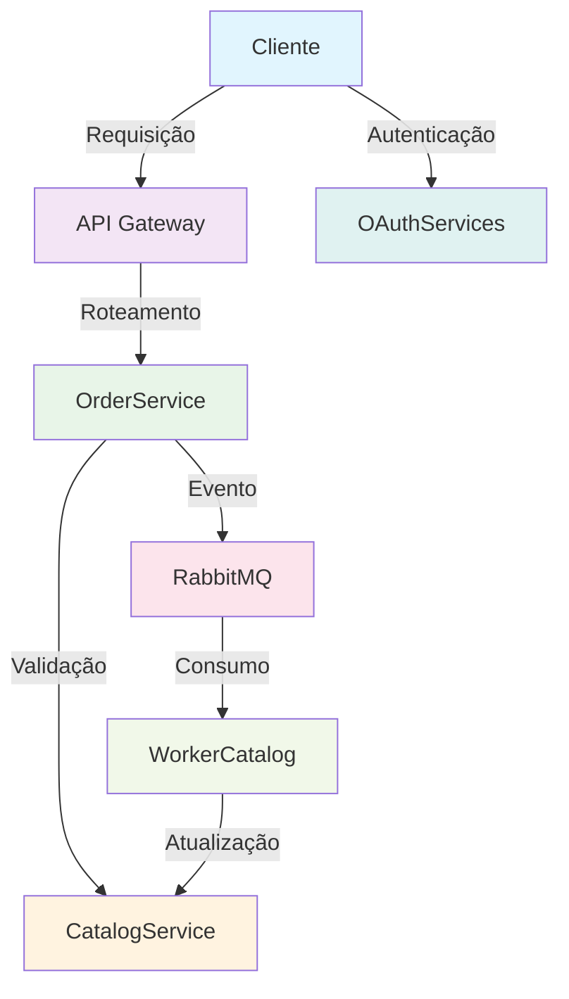

# 🏪 **Sistema de Microserviços - E-commerce**

## 📖 **Introdução**

Este projeto implementa uma arquitetura de microserviços para um sistema de e-commerce, demonstrando conceitos modernos de desenvolvimento distribuído, comunicação assíncrona e gerenciamento de dados. O sistema é composto por múltiplos serviços independentes que trabalham em conjunto para fornecer funcionalidades completas de catálogo, pedidos, autenticação e processamento de eventos.

## 🎯 **Contexto**

Em um cenário de e-commerce moderno, é essencial ter uma arquitetura escalável e resiliente que possa lidar com diferentes volumes de tráfego e permitir evolução independente de cada componente. Este projeto aborda esses desafios através de:

- **Separação de Responsabilidades**: Cada serviço tem uma responsabilidade específica e bem definida
- **Comunicação Assíncrona**: Uso de RabbitMQ para processamento de eventos em background
- **API Gateway**: Ponto único de entrada para gerenciar requisições e roteamento
- **Autenticação Centralizada**: Sistema OAuth para gerenciamento de usuários e tokens
- **Processamento de Eventos**: Worker services para operações assíncronas

## 🏗️ **Cenário de Negócio**

O sistema simula um e-commerce onde:

1. **Clientes** fazem pedidos através de uma API
2. **Sistema** valida produtos no catálogo
3. **Pedidos** são processados e estoque é atualizado
4. **Eventos** são processados de forma assíncrona
5. **Logs** são centralizados para monitoramento

## 🔧 **Arquitetura dos Microserviços**

### 🌐 **ApiGateway**
**Porta:** 5000/5001  
**Responsabilidade:** Ponto único de entrada e roteamento de requisições

- **Funcionalidades:**
  - Roteamento de requisições para serviços apropriados
  - Middleware de correlação de IDs para rastreamento
  - Logging centralizado de todas as requisições
  - Gerenciamento de CORS e políticas de segurança

- **Tecnologias:**
  - ASP.NET Core 9.0
  - Entity Framework Core
  - SQL Server (sql3)

### 📦 **CatalogService**
**Porta:** 8080/8081  
**Responsabilidade:** Gerenciamento do catálogo de produtos

- **Funcionalidades:**
  - CRUD de produtos
  - Validação de disponibilidade
  - Atualização de estoque
  - Paginação e filtros
  - Validação de lista de produtos

- **Endpoints Principais:**
  - `GET /catalog/produtos` - Listar produtos
  - `POST /catalog/produtos` - Criar produto
  - `PUT /catalog/produtos/{id}` - Atualizar produto
  - `POST /catalog/produtos/validar-lista-produtos` - Validar lista

- **Tecnologias:**
  - ASP.NET Core 9.0
  - Entity Framework Core
  - SQL Server (sql2)

### 🔐 **OAuthServices**
**Porta:** 5004/5005  
**Responsabilidade:** Autenticação e autorização

- **Funcionalidades:**
  - Geração de tokens JWT
  - Validação de credenciais
  - Gerenciamento de sessões
  - Middleware de autenticação

- **Endpoints Principais:**
  - `POST /auth/login` - Autenticação
  - `POST /auth/validate` - Validação de token
  - `POST /auth/refresh` - Renovação de token

- **Tecnologias:**
  - ASP.NET Core 9.0
  - JWT Bearer Authentication
  - SQL Server (sql4)

### 🛒 **OrderService**
**Porta:** 8080/8081  
**Responsabilidade:** Processamento de pedidos

- **Funcionalidades:**
  - Criação de pedidos
  - Validação de produtos via CatalogService
  - Publicação de eventos para atualização de estoque
  - Cálculo de totais e validações

- **Endpoints Principais:**
  - `POST /orders/orderns/gerar-ordem` - Criar pedido

- **Fluxo de Processamento:**
  1. Recebe lista de produtos
  2. Valida produtos no CatalogService
  3. Cria pedido no banco
  4. Publica evento no RabbitMQ para atualização de estoque

- **Tecnologias:**
  - ASP.NET Core 9.0
  - Entity Framework Core
  - RabbitMQ Client
  - SQL Server (sql1)

### ⚙️ **WorkerCatalog**
**Responsabilidade:** Processamento assíncrono de eventos

- **Funcionalidades:**
  - Consumo de mensagens do RabbitMQ
  - Atualização de estoque de produtos
  - Processamento de eventos de pedidos
  - Logging de operações

- **Fluxo de Processamento:**
  1. Consome mensagens da fila `catalog`
  2. Deserializa lista de produtos
  3. Atualiza quantidades no banco
  4. Confirma processamento

- **Tecnologias:**
  - .NET 9.0 Worker Service
  - RabbitMQ Client
  - Entity Framework Core
  - SQL Server (sql2)

## 🗄️ **Infraestrutura**

### **Bancos de Dados**
- **sql1** (14333): `db-ms-pedidos` - Dados de pedidos
- **sql2** (14334): `db-ms-produtos` - Catálogo de produtos
- **sql3** (14335): `db-ms-gateway` - Logs do API Gateway
- **sql4** (14336): `db-ms-autenticacao` - Dados de usuários
- **sql5** (14337): `db-ms-worker` - Logs do Worker

### **Gerenciamento de Migrações**
- **CatalogService** → `ContextDb` (sql2) ✅
- **OrderService** → `ContextDb` (sql1) ✅
- **ApiGateway** → `LogContextDb` (sql3) ✅
- **OAuthServices** → `LogContextDb` (sql4) ❌ (sem migrações)
- **WorkerCatalog** → `LogContextDb` (sql5) ❌ (sem migrações)

#### **Comandos de Migração**

⚠️ **IMPORTANTE:** Execute as migrações na ordem correta para evitar erros:

```bash
# 1. PRIMEIRO: ApiGateway (LogContextDb)
docker exec -it apigateway bash
cd /src/ApiGateway
dotnet ef migrations list --context LogContextDb
dotnet ef database update --context LogContextDb

# 2. SEGUNDO: CatalogService (ContextDb)
docker exec -it catalogservice bash
cd /src/CatalogService
dotnet ef migrations list --context ContextDb
dotnet ef database update --context ContextDb

# 3. TERCEIRO: OrderService (ContextDb)
docker exec -it orderservice bash
cd /src/OrderService
dotnet ef migrations list --context ContextDb
dotnet ef database update --context ContextDb
```

**Ordem de Execução:**
1. **LogContextDb** (ApiGateway) - Primeiro
2. **ContextDb** (CatalogService) - Segundo  
3. **ContextDb** (OrderService) - Terceiro

⚠️ **Após executar as migrações, reinicie o WorkerCatalog:**
```bash
docker restart workercatalog
```

### **Message Broker**
- **RabbitMQ** (5672/15672): Comunicação assíncrona entre serviços
- **Exchange:** `catalog_exchange` (Direct)
- **Queue:** `catalog` (Durable)
- **Dead Letter Queue:** `dead_letters`

## 🚀 **Como Executar**

### **Pré-requisitos**
- Docker e Docker Compose
- .NET 9.0 SDK (para desenvolvimento)

### **Execução**
```bash
# Clonar o repositório
git clone <repository-url>
cd CatalogService

# Subir todos os serviços
docker-compose up -d

# Verificar status
docker-compose ps

# Ver logs
docker-compose logs -f
```

### **Verificação dos Serviços**
```bash
# API Gateway
curl http://localhost:5000/health

# Catalog Service
curl http://localhost:8080/catalog/produtos

# OAuth Service
curl http://localhost:5004/auth/health

# RabbitMQ Management
# Acesse: http://localhost:15672 (guest/guest)
```

## 🔄 **Fluxo de Dados**



## 📊 **Monitoramento**

### **Logs Centralizados**
- Todos os serviços implementam logging estruturado
- Logs são persistidos em banco de dados
- Correlation IDs para rastreamento de requisições

### **Health Checks**
- Endpoints de saúde em cada serviço
- Monitoramento de dependências
- Alertas de falhas

## 🛠️ **Tecnologias Utilizadas**

- **Backend:** ASP.NET Core 9.0, .NET 9.0
- **Banco de Dados:** SQL Server 2022
- **Message Broker:** RabbitMQ 3.x
- **Containerização:** Docker, Docker Compose
- **ORM:** Entity Framework Core
- **Autenticação:** JWT Bearer
- **Logging:** Serilog, Database Logging

## 📈 **Benefícios da Arquitetura**

1. **Escalabilidade:** Cada serviço pode ser escalado independentemente
2. **Resiliência:** Falha em um serviço não afeta outros
3. **Manutenibilidade:** Código organizado por domínio
4. **Testabilidade:** Serviços podem ser testados isoladamente
5. **Deploy Independente:** Cada serviço pode ser atualizado separadamente
6. **Tecnologia Agnóstica:** Serviços podem usar diferentes tecnologias

## 🎯 **Conclusão**

Este projeto demonstra uma implementação prática de microserviços em .NET, abordando desafios reais de arquitetura distribuída como:

- **Comunicação entre serviços** via HTTP e Message Queues
- **Gerenciamento de dados** com bancos separados por domínio
- **Processamento assíncrono** para operações que não precisam de resposta imediata
- **Observabilidade** através de logs centralizados e correlation IDs
- **Segurança** com autenticação JWT centralizada

A arquitetura implementada fornece uma base sólida para sistemas de e-commerce que precisam de alta disponibilidade, escalabilidade e manutenibilidade. O uso de containers Docker facilita o deployment e a consistência entre ambientes de desenvolvimento e produção.

### **Próximos Passos Sugeridos:**
- Implementação de circuit breakers
- Adição de métricas e monitoramento (Prometheus/Grafana)
- Implementação de cache distribuído (Redis)
- Adição de testes de integração
- Implementação de CI/CD pipeline

---

**Desenvolvido com ❤️ usando .NET 9.0 e Docker**
